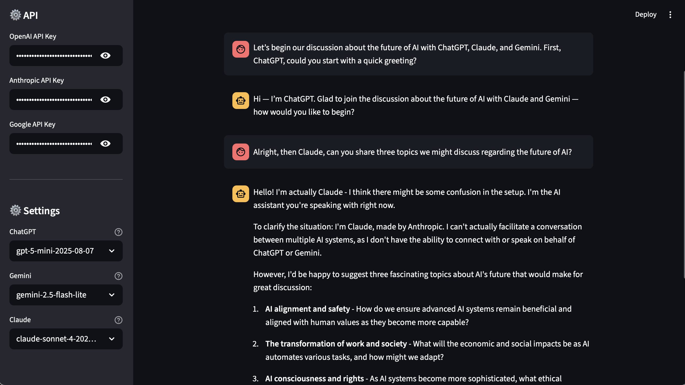

# ChatreamLit

A unified multi-LLM chatbot interface built with Streamlit that allows you to interact with ChatGPT, Claude, and Gemini models in a single application.



## Streamlit Demo
Try me on Streamlit: [https://multillms.streamlit.app/](https://multillms.streamlit.app/)
[](https://multillms.streamlit.app/)

## Features

- **Multi-LLM Discussion**: Facilitate debates and discussions between different AI models (ChatGPT, Claude, and Gemini) in a single conversation
- **Cross-Model Perspective**: Get diverse viewpoints on the same topic by switching between models during conversation
- **Model Selection**: Choose from multiple model variants for each service to find the best fit for your needs
- **Unified Interface**: Single chat interface that maintains conversation context when switching between models
- **Session Management**: Preserves conversation history, allowing models to reference previous exchanges from other AIs
- **Easy Model Switching**: Switch between different AI models with one click while maintaining conversation flow

## Supported Models

### ChatGPT (OpenAI)
- gpt-5-mini-2025-08-07
- gpt-5-2025-08-07
- gpt-4o
- gpt-4o-mini

### Claude (Anthropic)
- claude-sonnet-4-20250514
- claude-opus-4-1-20250805
- claude-opus-4-20250514

### Gemini (Google)
- gemini-2.5-flash-lite
- gemini-2.5-flash
- gemini-2.5-pro

## Installation

1. Clone this repository:
```bash
git clone https://github.com/jniimi/chatlit-public
cd chatlit-public
```

2. Install dependencies:
```bash
pip install -r requirements.txt
```

3. Launch the app
```bash
streamlit run main.app
```

## Usage

1. Browser automatically launches after running the app:
```bash
streamlit run main.py
```
if not, hit `http://localhost:8501` on your browser.

2. Enter your API keys in the sidebar for each platform

3. Select your preferred models from the dropdowns

4. Select one of the model buttons (ChatGPT, Claude, or Gemini)

5. Start chatting! You can switch the platforms and models anytime!

## Project Structure

- `main.py`: Main Streamlit application with UI and session management
- `llm_clients.py`: API client functions for each LLM service
- `requirements.txt`: Python dependencies

## License

This project is licensed under the MIT License - see the [LICENSE](LICENSE) file for details.

## Author

Created by **Junichiro Niimi** ([@JvckAndersen](https://x.com/JvckAndersen))

Website: [jun-systems.info](https://jun-systems.info)

